  

## 👋 About

Frontend engineer focused on building expressive, high-performance interfaces and AI-powered products — from frontend architecture and design systems to agents and automation.

🎯 **Focus:** Frontend Engineering · AI Products · Agents · Automation  
📍 **Based in:** Moscow, RU  
📫 **Email:** [kesar21fd@gmail.com](mailto:kesar21fd@gmail.com)

## 🛠 Tech Stack

  

`JavaScript` · `TypeScript` · `React` · `Next.js` · `Node.js` · `MongoDB`  
`Express` · `Webpack` · `Docker` · `Python` · `Git` · `Figma`

---

  Designing interfaces for humans. Building systems for the AI era.

